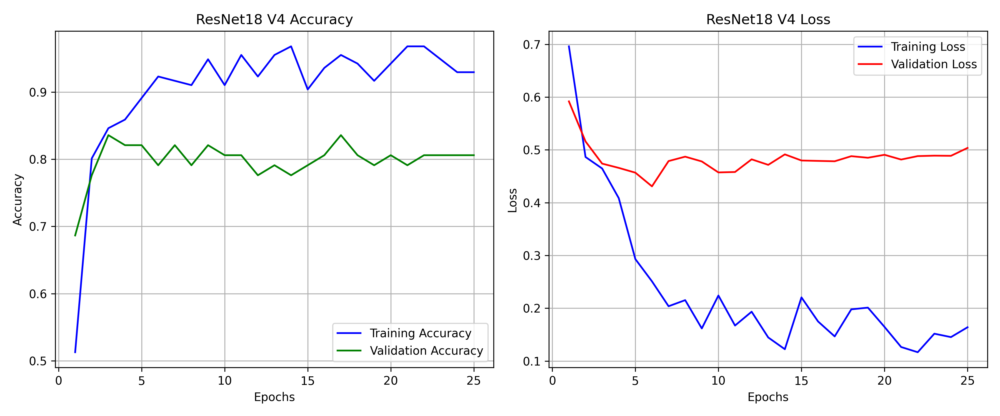

# Cattle Health Classifier: Edge-AI Barn Monitoring

An intelligent, hybrid computer vision application designed to monitor cattle health in real-time. This system combines **YOLOv8x** for robust object tracking in crowded barn environments with a custom-trained **ResNet18** neural network to diagnose signs of lameness or illness based on posture and visual indicators.


## Key Features

* **Dual-Mode Analysis:** * **Snapshot Mode:** Drag-and-drop static image analysis for rapid, high-accuracy individual cow diagnostics.
  * **Live Video Feed:** Processes MP4 barn footage frame-by-frame, tracking multiple animals simultaneously.
* **Smart Bounding Box Filtering:** Automatically filters out "fractional" cows (e.g., heads poking through metal grates) using dynamic size and area algorithms to prevent false-positive classifications.
* **Color-Aware Diagnostics:** The custom ResNet18 model (V4) was specifically trained on full RGB imagery, allowing it to detect critical health indicators like coat condition and tongue/gum coloration.
* **Gradio Web Interface:** A clean, responsive UI that can be deployed locally or hosted on cloud platforms like Hugging Face Spaces.

## System Architecture

The pipeline utilizes a two-step "Crop and Classify" architecture to maximize accuracy on edge devices:

1. **Detection (YOLOv8x):** Scans the video frame, identifies all cattle, and draws precise bounding boxes.
2. **Preprocessing (PyTorch Transforms):** Extracts the bounding boxes. For video, it uses a non-destructive squish transform (`224x224`) to ensure vital anatomy (like a resting head or hooves) is not removed by center-cropping.
3. **Classification (ResNet18):** Analyzes the isolated crop and outputs a binary diagnostic probability (`Healthy` vs. `Sick`).

## 📊 Training Results & Evaluation


*Figure: Training and Validation Accuracy/Loss over 25 epochs. The pipeline uses an early-stopping mechanism to save the weights at the optimal epoch (lowest validation loss).*

**Final Validation Accuracy:** `83.58%`

## 📈 Interpreting the Training Metrics (Overfitting & Mitigation)

**Final Validation Accuracy:** `83.58%`

At first glance, the metrics graph above displays a textbook example of **overfitting** in the later epochs. This is a common and expected challenge when training complex neural networks on highly specialized, custom agricultural datasets.

### The Problem: Divergence
Looking at the **Loss Graph (right)**, the training loss (blue line) continuously decreases toward zero as the epochs progress. However, the validation loss (red line) hits its absolute minimum around Epoch 6, and then gradually begins to rise. This divergence indicates the exact moment the neural network stopped learning general rules about cattle health and started "memorizing" the specific cows in the training set.

### The Engineering Solutions: Combatting Memorization
To achieve a robust 83.58% validation accuracy on a low-volume dataset without collapsing into complete memorization, the pipeline was engineered with three specific countermeasures:

1. **Transfer Learning & Layer Freezing:** Instead of training from scratch, the system utilizes a pre-trained ResNet18 base. The early network layers (responsible for basic shape and edge detection) were intentionally mathematically frozen (`param.requires_grad = False`). Only the final convolutional block (`layer4`) and the custom head were unfrozen. This allows the model to learn complex, cow-specific features without destroying its foundational visual logic.
2. **Aggressive Regularization (Dropout):** To actively fight the memorization seen in the graph, a Dropout layer (`nn.Dropout(0.5)`) was injected into the classification head. By randomly "turning off" 50% of the neurons during every single training pass, the network is forced to distribute its learning and build redundant, robust feature pathways rather than relying on a few dominant pixels.
3. **Dynamic Checkpointing:** If we had simply deployed the model at Epoch 25, it would perform poorly in the real world due to eventual overfitting. To solve this, the PyTorch training pipeline was engineered with a best-weight checkpointing mechanism. It continuously monitors the `epoch_acc` against the `best_acc` variable in real-time, completely ignoring the overfit weights generated in the later epochs. It automatically captures and deep-copies the state (`best_model_wts = copy.deepcopy(model.state_dict())`) at the exact historical moment the validation accuracy peaks.

By deliberately allowing the model to train past its peak and into an overfit state, we ensure the algorithm explores the entire gradient. We then extract the "smartest" historical checkpoint, guaranteeing the final deployed `.pth` file is optimized for real-world, generalized inference rather than training-set memorization.

* **Detection Model:** YOLOv8x (Ultralytics)
* **Classification Model:** ResNet18 (PyTorch)
* **Confidence Threshold:** `0.35` for YOLO bounding boxes (optimized for crowd tracking without duplicate box generation).

## ⚙️ Local Setup & Installation

To run this application on your local machine (GPU recommended for video processing):

**1. Clone the repository:**
```bash
git clone [https://github.com/AbdulDag/Cattle-Health-Classification-Model.git](https://github.com/AbdulDag/Cattle-Health-Classification-Model.git)
cd Cattle-Health-Classification-Model

2. Install dependencies:
Make sure you have Python 3.8+ installed.

Bash
pip install -r requirements.txt
(Note: If you are using a CUDA-enabled NVIDIA GPU, install the appropriate PyTorch build from the official PyTorch website first).

3. Run the application:

Bash
python app.py
A local web server will start, and you can view the interface by navigating to http://127.0.0.1:7860 in your browser.

Note on Weights: The custom ResNet18 weights (best_cow_classifier_v4.pth) are included in the models/ directory. The YOLOv8x weights (yolov8x.pt) are omitted from version control due to file size limits, but will automatically download directly from Ultralytics the first time you run the script.

Usage
Snapshot Tab: Upload a clear, single image of a cow. The system will output a probability bar indicating health status.

Video Tab: Upload an .mp4 video. The system will process the footage and output a new .mp4 video with diagnostic bounding boxes tracking every detected animal.

```
 Built With
PyTorch & Torchvision, Ultralytics YOLO, Gradio, OpenCV
